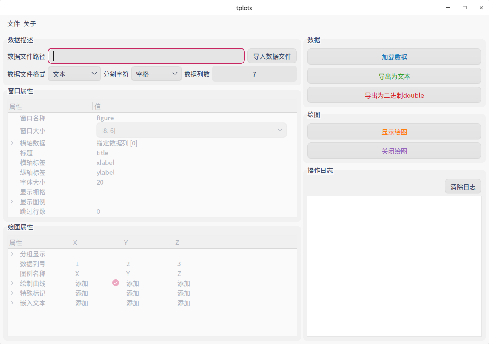
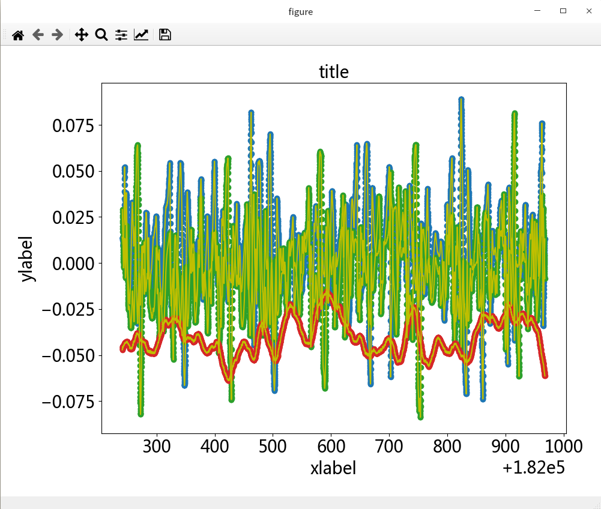
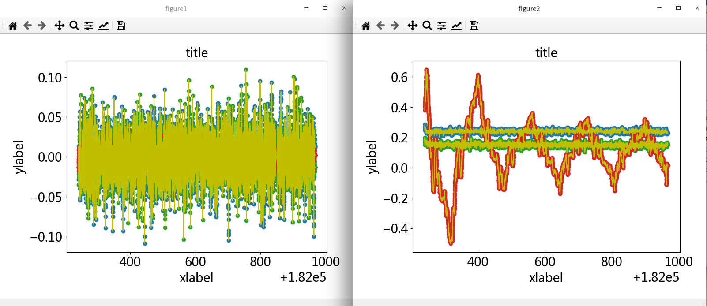

# **tplots**

## **A novel GUI plot tool**



**tplots**是一个交互式绘图工具，使用Python语言编写。tplots使用`PyQt5`作为前端交互GUI，使用`matplotlib`绘图显示，绘图使用PyQt5为后端。

**Author**: hailiang (thl@whu.edu.cn), linfeng (linfeng_bao@outlook.com), ruonan (grn213331@163.com)

## **1 Features**

- 支持任意数据文件，包括文本和二进制文件；
- 窗口自定义，窗口大小、标题、坐标轴、栅格、图例等自定义；
- 字体大小、曲线样式、标记样式、颜色等自定义；
- 支持同时显示3轴曲线和3轴标记；
- 支持窗口嵌入文本，支持三通道文本嵌入，颜色和字体大小自定义。
- 支持自定义横轴数据，指定任意列为横轴或者使用计数值；
- 支持自定义纵轴数据，指定任意列为纵轴；
- 支持多窗口绘图，修改窗口名称，即可实现多窗口绘图；
- 人性化操作日志，友好的提示；
- 待续...

## **2 Prerequisites**

**tplots**使用纯Python语言编写，使用开源库`matplotlib`、`pyqt5`、`pandas`和`numpy`，仅支持**Python3**运行环境。

使用`pip`安装依赖库：

```bash
pip install matplotlib pyqt5 pandas numpy
```

如果你使用**Anaconda**或者**Miniconda**，使用`conda`安装依赖库：

```bash
conda install matplotlib pyqt5 pandas numpy
```

## **3 Use tplots**

### **3.1 Run tplots** 

使用Python执行tplots.py脚本，即可显示tplots交互界面。

```bash
python tplots.py
```

### **3.2 颜色**

使用matlotlib支持的颜色格式，仅支持字符串形式的表示。

| 类型                | 样例                                              |
| ------------------- | ------------------------------------------------- |
| 单字符              | blue: 'b', green: 'g', red: 'r'                   |
| 全称                | blue: 'blue', green: 'green', red: 'red'          |
| 十六进制RGB or RGBA | blue: '#0000FF', green: '#00FF00', red: '#FF0000' |

更多颜色表达形式请参考 [`matplotlib.colors`](https://matplotlib.org/api/colors_api.html#module-matplotlib.colors)

### **3.3 文本**

tplots中的文本支持`latex`数学公式，使用`$`作为渲染识别符号。非公式文本字体为`微软雅黑`，数学公式字体为`Computer Modern`。

| 样例                                  | 效果                  |
| ------------------------------------- | --------------------- |
| Normal text: text                     | text                  |
| Math text: \$y=sin^2(x)\$             | $y=sin^2(x)$          |
| Mixed text: velocity(\$v\$) [\$m/s\$] | velocity($v$) [$m/s$] |

更多文本信息请参考matplotlib文档 [`Writing mathematical expressions`](https://matplotlib.org/tutorials/text/mathtext.html)

### **3.4 Lines with markers**

同时勾选曲线和标记，可以绘制优美的图形。



### **3.5 Multi figures**

只需修改`窗口名称`，即可实现多窗口绘图。



## **4 Acknowledge**

如果您觉得tplots对您的学术研究很有帮助，您可以在发表学术研究成果时适当的表示感谢，我们尊重您的选择。
